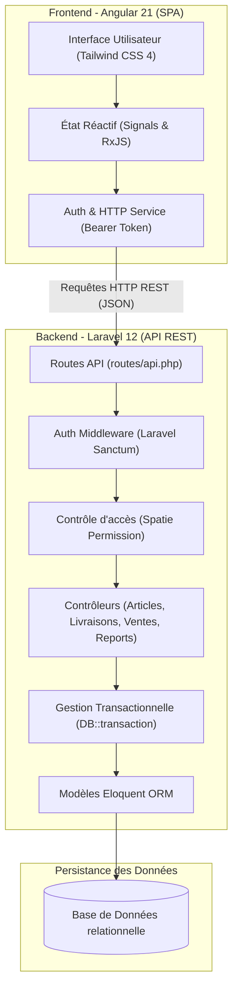
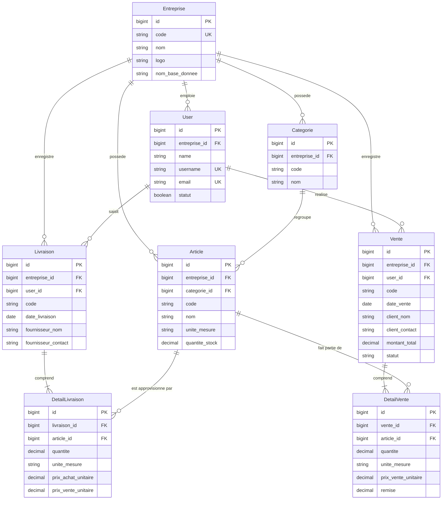
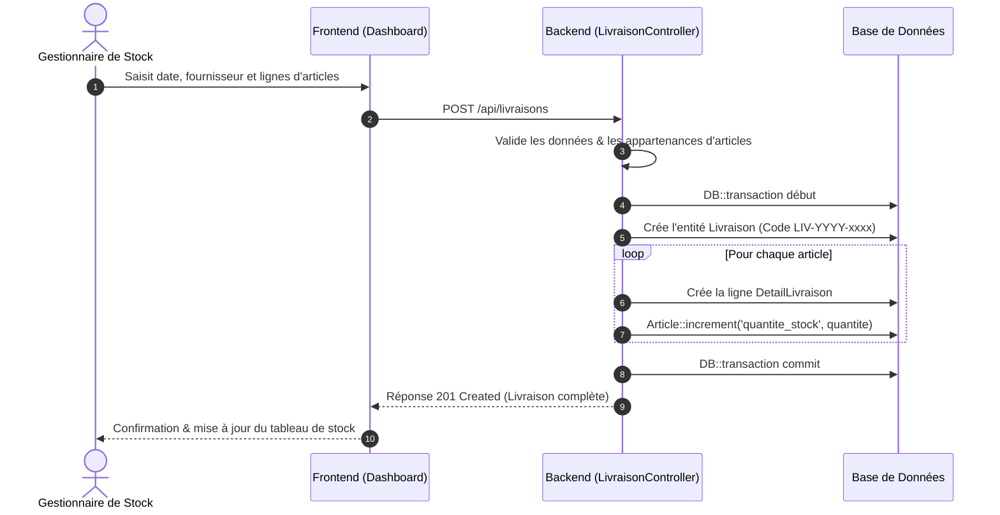
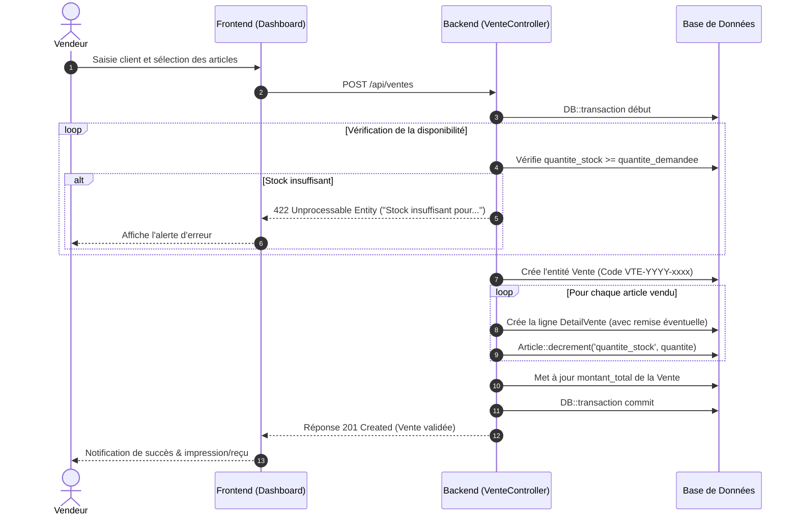
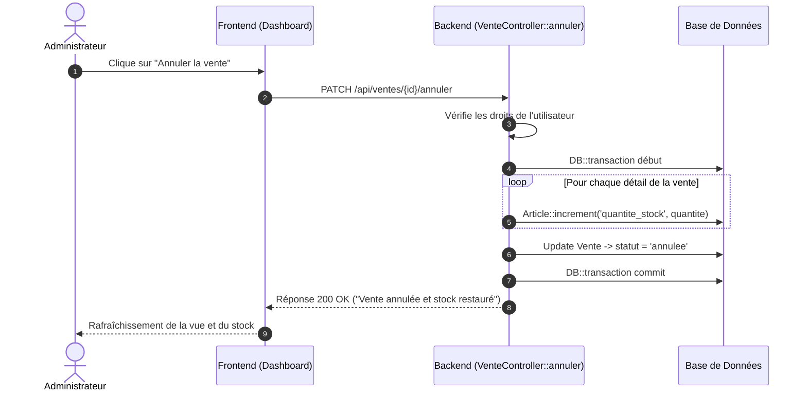
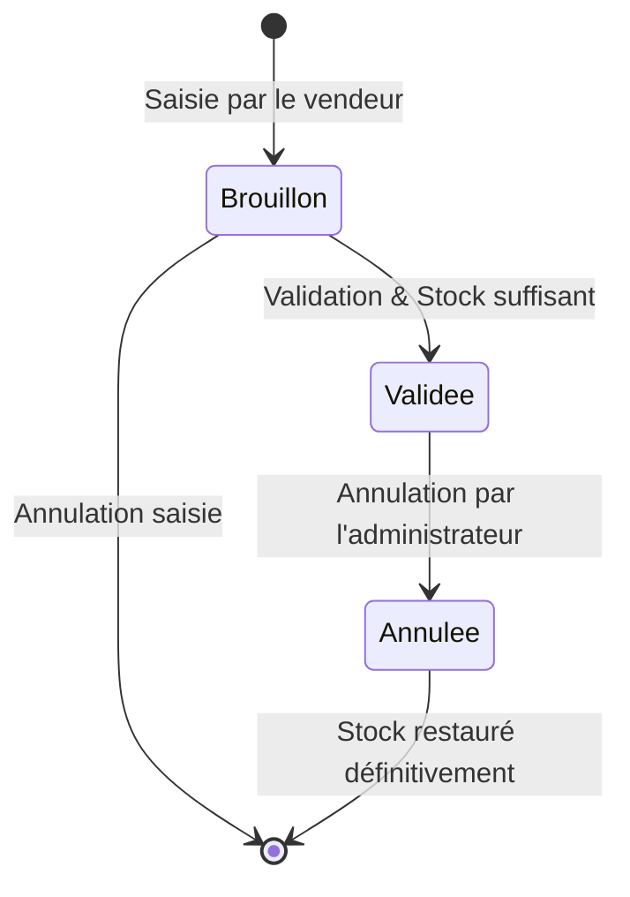

# 3SV - Système de Suivi des Stocks et des Ventes

Plateforme web moderne de **gestion commerciale, de suivi des stocks et de gestion des ventes multi-entreprises**.

---

## 📋 Table des matières

- [Présentation](#-présentation)
- [Stack Technique](#-stack-technique)
- [Architecture Globale](#-architecture-globale)
- [Modèle de Données (ERD)](#-modèle-de-données-erd)
- [Rôles et Matrice des Droits (RBAC)](#-rôles-et-matrice-des-droits-rbac)
- [Flux Métier & Solutions Clés](#-flux-métier--solutions-clés)
  - [1. Entrée de stock (Livraison Fournisseur)](#1-entrée-de-stock-livraison-fournisseur)
  - [2. Sortie de stock (Vente Client avec Contrôle de Stock)](#2-sortie-de-stock-vente-client-avec-contrôle-de-stock)
  - [3. Annulation de Vente & Restauration du Stock](#3-annulation-de-vente--restauration-du-stock)
  - [4. Cycle de Vie d'une Vente](#4-cycle-de-vie-dune-vente)
- [Installation et Démarrage](#-installation-et-démarrage)
  - [Prérequis](#prérequis)
  - [Backend (Laravel 12)](#backend-laravel-12)
  - [Frontend (Angular 21)](#frontend-angular-21)
- [Comptes de Démonstration](#-comptes-de-démonstration)
- [Structure du Projet](#-structure-du-projet)

---

## 🚀 Présentation

**3SV** est une application web conçue pour répondre aux besoins de gestion quotidienne d'une ou plusieurs entreprises commerciales :
- **Multi-entreprises (Multi-tenant)** : Cloisonnement strict des données entre différentes entités économiques.
- **Gestion du catalogue** : Gestion hiérarchique des catégories et des articles avec unités de mesure fractionnaires (`kg`, `litre`, `sac`, `pièce`).
- **Traçabilité des flux de stocks** : Réception des approvisionnements (livraisons) et sorties (ventes) gérées sous transactions SQL avec horodatage et audibilité.
- **Contrôle d'intégrité** : Blocage automatique des ventes si le stock est insuffisant.
- **Reporting & Analyse financière** : Synthèse périodique (journalière, hebdomadaire, mensuelle, annuelle) du chiffre d'affaires, des dépenses d'achats, de la marge brute estimée et du top des articles.

---

## 🛠 Stack Technique

### Backend
- **Framework** : [Laravel 12](https://laravel.com) (PHP 8.2+)
- **Authentification** : Laravel Sanctum (Tokens d'API)
- **Permissions & Rôles** : `spatie/laravel-permission`
- **Data Transfer Objects (DTO)** : `spatie/laravel-data`
- **Base de données** : SQLite (développement) / MySQL ou PostgreSQL (production)

### Frontend
- **Framework** : [Angular 21](https://angular.dev) (Standalone Components, Signals réactifs, nouveau Control Flow `@if`/`@for`)
- **Design & Styles** : [Tailwind CSS 4](https://tailwindcss.com) + PostCSS
- **Tests Unitaires** : Vitest + JSDOM

---

## 🏗 Architecture Globale

L'application repose sur un modèle d'architecture découplée SPA / API REST.



---

## 🗄 Modèle de Données (ERD)

Le schéma ci-dessous décrit les entités du système et leurs interrelations :



---

## 👥 Rôles et Matrice des Droits (RBAC)

| Fonctionnalité | `administrateur_plateforme` | `administrateur_entreprise` | `gestionnaire_stock` | `vendeur` |
| :--- | :---: | :---: | :---: | :---: |
| **Gestion globale des entreprises** | ✅ | ❌ | ❌ | ❌ |
| **Sélection / Changement d'entreprise** | ✅ | ❌ (Fixé) | ❌ (Fixé) | ❌ (Fixé) |
| **Gestion des utilisateurs & rôles** | ✅ (Tous) | ✅ (Locaux) | ❌ | ❌ |
| **Gestion du catalogue (Catégories/Articles)** | ✅ | ✅ | ✅ (Création rapide) | ❌ |
| **Entrées de stock (Livraisons)** | ✅ | ✅ | ✅ | ❌ |
| **Sorties de stock (Ventes)** | ✅ | ✅ | ❌ | ✅ |
| **Annulation de vente** | ✅ | ✅ | ❌ | ❌ |
| **États financiers & Rapports** | ✅ | ✅ | ✅ | ❌ |

---

## 🔄 Flux Métier & Solutions Clés

### 1. Entrée de stock (Livraison Fournisseur)
L'approvisionnement incrémente automatiquement et de manière atomique la quantité disponible en stock.



---

### 2. Sortie de stock (Vente Client avec Contrôle de Stock)
Lorsqu'un vendeur effectue une vente, le système vérifie d'abord que chaque article est en stock suffisant avant d'appliquer la décrémentation.



---

### 3. Annulation de Vente & Restauration du Stock
Seul un administrateur peut annuler une vente. L'opération restaure intégralement les quantités en stock.



---

### 4. Cycle de Vie d'une Vente



---

## 💻 Installation et Démarrage

### Prérequis
- **PHP** : >= 8.2 avec extensions SQLite / PDO / cURL / OpenSSL / Mbstring
- **Composer** : >= 2.x
- **Node.js** : >= 20.x et **npm** >= 10.x

---

### Backend (Laravel 12)

1. Rendez-vous dans le dossier backend :
   ```bash
   cd backend
   ```

2. Installez les dépendances PHP :
   ```bash
   composer install
   ```

3. Configurez les variables d'environnement :
   ```bash
   copy .env.example .env
   php artisan key:generate
   ```

4. Exécutez les migrations et les seeders :
   ```bash
   php artisan migrate --seed
   ```

5. Lancez le serveur local :
   ```bash
   php artisan serve
   ```
   > L'API sera accessible sur : `http://127.0.0.1:8000`

---

### Frontend (Angular 21)

1. Rendez-vous dans le dossier frontend :
   ```bash
   cd frontend
   ```

2. Installez les dépendances npm :
   ```bash
   npm install
   ```

3. Démarrez le serveur de développement :
   ```bash
   npm start
   # ou: npx ng serve
   ```
   > L'application web sera accessible sur : `http://localhost:4200`

---

## 🔑 Comptes de Démonstration

Après l'exécution des seeders (`php artisan migrate --seed`), deux comptes pré-configurés sont disponibles :

| Rôle | Nom d'utilisateur | Mot de passe | Description |
| :--- | :--- | :--- | :--- |
| **Super Admin Plateforme** | `admin` | `motdepasse` | Gestion transversale multi-entreprises |
| **Admin Entreprise** | `admin_ent` | `motdepasse` | Gestion de *"Ma Super Entreprise"* |

---

## 📂 Structure du Projet

```text
Gestion-Stock-BF/
├── backend/                        # API Laravel 12
│   ├── app/
│   │   ├── Http/Controllers/       # Contrôleurs API (Auth, Article, Vente, Livraison, Report...)
│   │   ├── Models/                 # Modèles Eloquent (Entreprise, Article, Vente, Livraison...)
│   │   ├── Support/                # Générateur de codes d'entités (EntityCode.php)
│   │   └── Data/                   # Objets de transfert de données Spatie
│   ├── config/                     # Configuration (CORS, Sanctum, Permission...)
│   ├── database/
│   │   ├── migrations/             # Schémas de base de données
│   │   └── seeders/                # Données initiales (Rôles, Entreprise, Utilisateurs)
│   └── routes/
│       └── api.php                 # Déclaration des endpoints REST
│
├── frontend/                       # Application Angular 21
│   ├── src/
│   │   ├── app/
│   │   │   ├── login/              # Page d'authentification
│   │   │   ├── register/           # Création de collaborateurs
│   │   │   ├── edit-user/          # Édition des utilisateurs
│   │   │   ├── dashboard/          # Tableau de bord principal (Catalogue, Stocks, Ventes, Rapports)
│   │   │   └── services/           # Service d'authentification et appels API HTTP
│   │   ├── styles.css              # Styles globaux & Tailwind CSS
│   │   └── main.ts                 # Point d'entrée Angular
│   └── package.json
│
└── README.md                       # Documentation du projet
```
